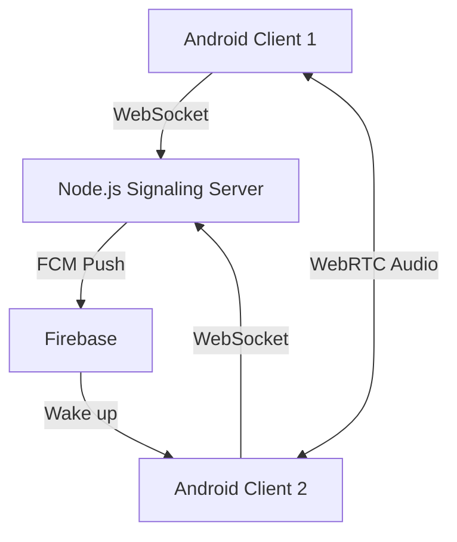

# Factory Talk

A modern Push-to-Talk (Walkie Talkie) Android application designed specifically for factory environments.

## Architecture

## Tech Stack
- **Android App:** Kotlin, Jetpack Compose, Hilt, Coroutines
- **Signaling Server:** Node.js, Socket.IO, TypeScript
- **Backend/Auth:** Firebase Authentication (Phone), Firestore
- **Audio Engine:** WebRTC (`io.getstream:stream-webrtc-android`)
- **Push Notifications:** Firebase Cloud Messaging (FCM)

## Project Structure
- `/android` - Android App source code.
- `/server` - Node.js Signaling Server source code.
- `/docs` - Setup and Deployment guides.
- `/firebase` - Firebase configuration and rules.

## Setup Instructions
See `/docs/setup-guide.md` for detailed instructions on how to run this project.
